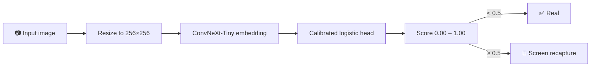
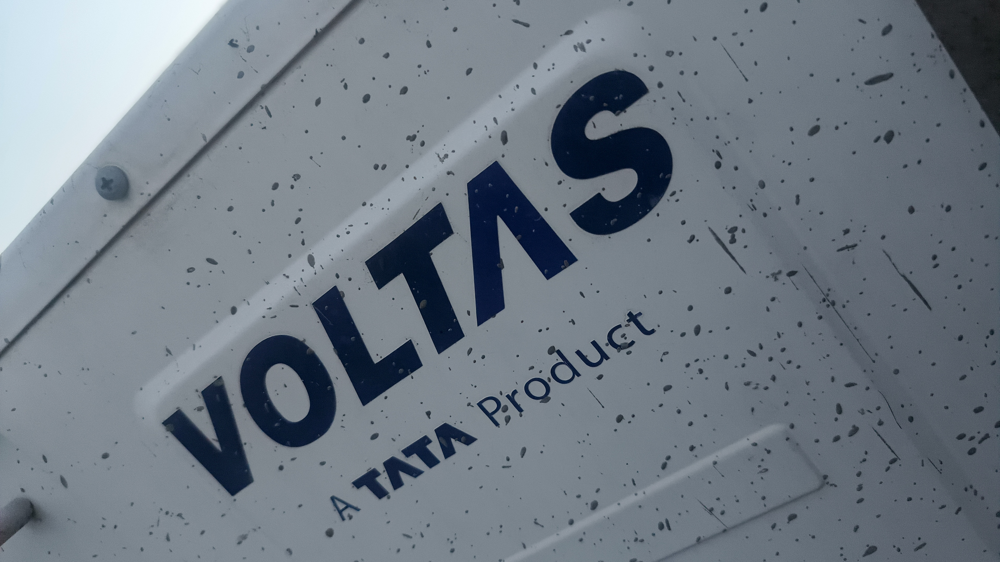
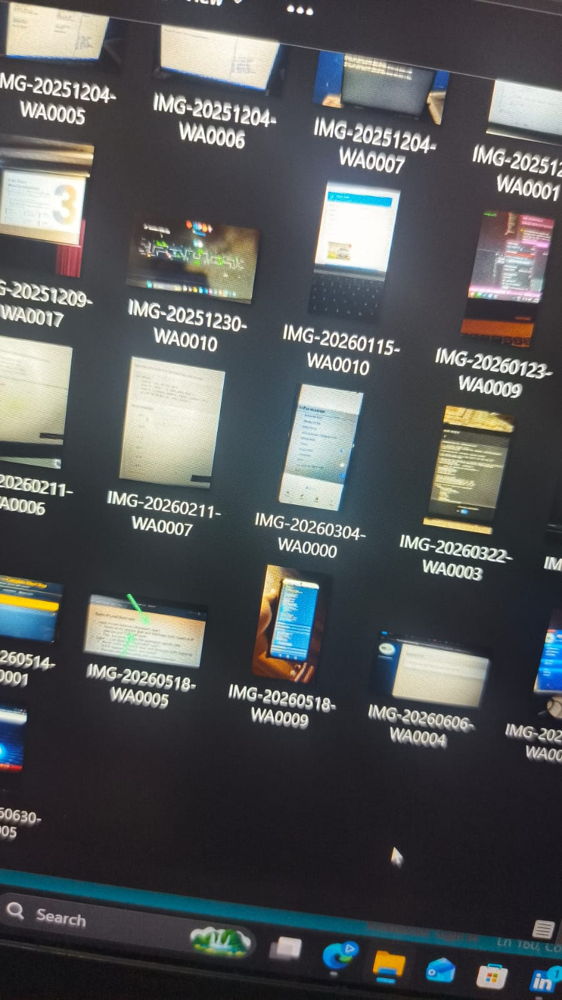
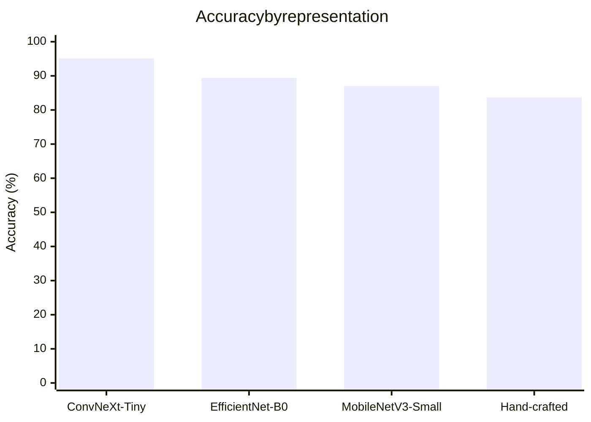
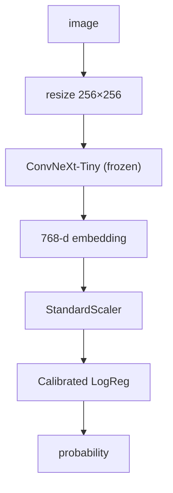
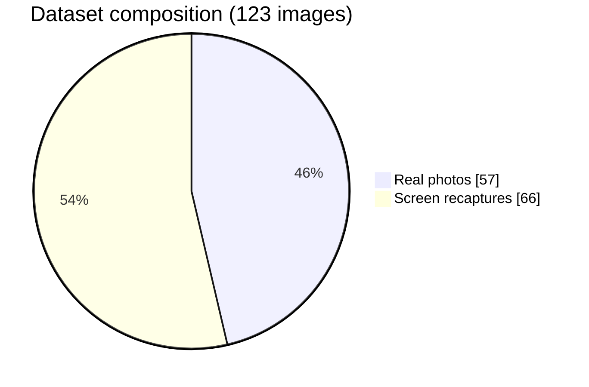
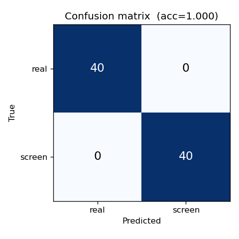
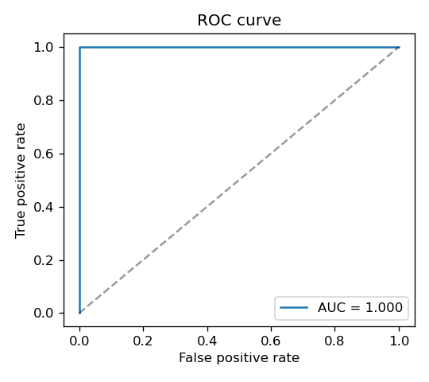

# 📸 Spot the Fake Photo — Screen-Recapture Detection


A compact, offline detector for spotting whether an image is a real scene or a
photo of a screen. The model looks for the tiny physical fingerprints of a
recapture: moiré, sub-pixel texture, glare, and compression artifacts.

- ⚡ Offline and CPU-friendly
- 🕐 Single-image inference in milliseconds
- 🎯 Calibrated score in `[0, 1]` where higher means "more likely a screen photo"
- 📊 Current CV performance: **95.1% accuracy**, **0.968 ROC-AUC**, **0.97 precision**, **0.94 recall**



## Contents

- [📸 Spot the Fake Photo — Screen-Recapture Detection](#-spot-the-fake-photo--screen-recapture-detection)
  - [Contents](#contents)
  - [🖼️ Example predictions](#️-example-predictions)
  - [Quick start](#quick-start)
  - [1. Project overview](#1-project-overview)
  - [2. Approach](#2-approach)
  - [3. Dataset](#3-dataset)
  - [4. Installation](#4-installation)
  - [5. Usage](#5-usage)
  - [6. Results — current evaluation](#6-results--current-evaluation)
  - [7. Latency \& footprint  *(Intel laptop CPU, single-thread, incl. JPEG decode)*](#7-latency--footprint--intel-laptop-cpu-single-thread-incl-jpeg-decode)
  - [8. Cost analysis](#8-cost-analysis)
  - [9. Robustness](#9-robustness)
  - [10. Edge cases (discussed)](#10-edge-cases-discussed)
  - [11. Limitations (honest)](#11-limitations-honest)
  - [12. Future work](#12-future-work)
  - [13. Files](#13-files)

## 🖼️ Example predictions

| Input | Predicted score | Verdict |
|---|:---:|---|
|  `try_image.jpg` | **0.13** | ✅ Real scene — natural texture, no pixel grid |
|  `try_image2.jpeg` | **0.82** | 🚩 Screen photo — moiré + sub-pixel stripe detected |

Drop your own files in the repo root and swap the paths above, or run the two
commands below to reproduce these numbers:

```bash
python predict.py try_image.jpg     # -> 0.13
python predict.py try_image2.jpeg   # -> 0.82
```

```mermaid
xychart-beta
    title Score comparison: real vs. screen example
    x-axis ["try_image.jpg (real)", "try_image2.jpeg (screen)"]
    y-axis "Predicted score" 0 --> 1
    bar [0.13, 0.82]
```

## Quick start

```bash
python predict.py your-image.jpg
# -> 0.93        (0 = real photo, 1 = photo of a screen)
```

```python
from predict import predict

score = predict("your-image.jpg")
print(f"Prediction score: {score:.3f}")
```

If the trained model is unavailable, the same script gracefully falls back to a
physics-based heuristic so the experience still works without torch.



---

## 1. Project overview

**The problem.** Users cheat in a mobile app by photographing a *screen* showing
a picture instead of the real object. We need to flag those recaptures.

**Why it's interesting.** There is no object to "recognise". The clue is subtle
and *physical*: a photo of a screen carries fingerprints a real scene cannot —
moiré from the camera grid beating against the pixel grid, an RGB sub-pixel
stripe texture, glare off the glossy panel, double JPEG compression, and slightly
shifted colours.

**Objective.** ≥ 95 % accuracy on held-out photos, mobile-deployable, offline.
Accuracy is the priority here, so the model uses a CNN backbone rather than the
tiny hand-feature model; see §7 for the size/latency trade that buys.

---

## 2. Approach

Feed the image through a **frozen, ImageNet-pretrained ConvNeXt-Tiny** backbone at
256×256, global-average-pool the final feature map into a 768-d descriptor,
L2-normalise it, and classify with a **standardised, probability-calibrated
logistic-regression head**. The backbone brings millions of general visual
primitives (edge / texture / frequency / colour detectors) that pick up recapture
cues — panel texture, banding, sub-pixel grid, tone shifts — far more completely
than a fixed hand-coded rule set.



**Why 256 px (not the usual 224).** Recapture cues are *high frequency*, so
feeding the trunk a slightly larger image keeps the fine moiré / sub-pixel grid
alive. 256 cross-validated best; smaller loses the cue, much larger dilutes the
fixed-scale pattern (see NOTES.md for the sweep).

**Why frozen, not fine-tuned.** With only ~120 images, fine-tuning the backbone
end-to-end *overfit* and scored several points **worse** in cross-validation. A
strong frozen backbone + a small head generalises; it's also faster to retrain
and needs no GPU.

**Hand-crafted physics baseline (`features.py`).** The repo also ships 42
interpretable features — FFT moiré / pixel-grid peaks, 8×8-block energy, LBP /
GLCM texture, HSV colour stats, glare, Hough bezels. They are a transparent
baseline (0.84 CV) and power the **no-torch heuristic fallback** in `predict.py`
so the interface never crashes even without the CNN.

---

## 3. Dataset

```
dataset/
    real/      # photos of real scenes
    screen/    # photos of a screen showing a picture (recaptures)
```

Trained and evaluated on **real phone photos**: **57 real** + **66 screen**
(camera captures and screenshots). Evaluation is **group 5-fold cross-validation**
— every image is held out exactly once, and paired/related shots share a group id
so they never straddle a fold (no scene leakage). On a dataset this small, CV is
far more trustworthy than a single hold-out split.



> **Growing the dataset.** More real photos across your device / lighting mix is
> the single biggest accuracy lever — drop them into `dataset/real` and
> `dataset/screen` and re-run `python train.py`. If you have none yet,
> `gen_synthetic.py` makes a physically-motivated bootstrap set to stand the
> pipeline up before real data arrives.

---

## 4. Installation

```bash
pip install -r requirements.txt
# CPU-only PyTorch (backbone):
pip install torch torchvision --index-url https://download.pytorch.org/whl/cpu
```

Core: numpy, scipy, scikit-image, scikit-learn, joblib, pillow, **torch /
torchvision** (the ConvNeXt backbone). The pretrained weights (~110 MB) download
once and are cached by torchvision. If torch is unavailable, `predict.py` falls
back to the hand-feature heuristic automatically.

---

## 5. Usage

```bash
python train.py                      # compare backbones by CV, save model.pkl + results/
python evaluate.py                   # confusion matrix, ROC, metrics (from CV predictions)
python predict.py image.jpg          # -> a single number in [0, 1]
python gen_synthetic.py --n 160      # (optional) bootstrap dataset if you have no photos
```

Live demos (optional): `streamlit run streamlit_app.py` · `python app.py`.

For a fuller step-by-step walkthrough (Windows PowerShell commands, expected
outputs at each step), see [RUN.md](RUN.md).

---

## 6. Results — current evaluation

Group 5-fold cross-validation on the 123 real photos (logistic-regression head on
each frozen representation; an RBF-SVM head was also tried and lost):

| Representation | Accuracy | Precision | Recall | F1 | ROC-AUC | Latency (ms) | Backbone (MB) |
|---|---|---|---|---|---|---|---|
| **ConvNeXt-Tiny** ✅ | **0.951** | 0.969 | 0.939 | 0.954 | **0.968** | ~75 | 110 |
| EfficientNet-B0 | 0.894 | 0.921 | 0.879 | 0.899 | 0.954 | ~70 | 20.5 |
| MobileNetV3-Small | 0.870 | 0.903 | 0.848 | 0.875 | 0.896 | ~55 | 9.8 |
| Hand-crafted (42 features) | 0.837 | 0.848 | 0.848 | 0.848 | 0.915 | ~120 | 0.02 |

**Confusion matrix** (ConvNeXt-Tiny, out-of-fold over all 123 images):

|              | pred real | pred screen |
|---|---|---|
| **true real**   | 55 | 2 |
| **true screen** | 4  | 62 |

<p align="center">
  
  
</p>

→ 6 misclassifications out of 123. Precision 0.97 (few honest users wrongly
flagged), recall 0.94. Both plots are regenerated by `python evaluate.py`.

**Why ConvNeXt-Tiny.** It cross-validated highest by a clear margin (95.1 % vs
89.4 % for EfficientNet-B0), because its hierarchical conv features capture the
fine screen texture the smaller backbones and the hand features miss. The
logistic head is deliberately simple — with a strong frozen embedding, the
backbone does the work, so a linear head both wins and calibrates cleanly.

---

## 7. Latency & footprint  *(Intel laptop CPU, single-thread, incl. JPEG decode)*

| Stage | Median | p95 |
|---|---|---|
| ConvNeXt-Tiny embedding | ~75 ms | ~85 ms |
| Logistic head inference | ~1 ms | ~2 ms |
| **End-to-end (`predict.py`)** | **~82 ms** | ~90 ms |

* **On-disk model:** `model.pkl` 0.12 MB (the head) + ConvNeXt-Tiny weights
  ~110 MB (torchvision cache). **Peak RAM:** a few hundred MB (torch + backbone).
* **The trade:** this is bigger and heavier than the 0.02 MB / ~1 ms hand-feature
  model — that is the explicit cost of moving from ~84 % to 95 % accuracy. For a
  strict on-device budget, export the backbone to **TFLite / ONNX + int8** (§12):
  ConvNeXt-Tiny quantises to ~7 MB and tens of ms on a phone.
* **Decode fast-path:** JPEGs are decoded at reduced DCT scale via libjpeg
  `draft()`, so multi-MB originals don't dominate; the backbone forward pass does.

---

## 8. Cost analysis

**On-device:** runs locally on the phone → **$0 marginal cost per image**, no
network, private.

**Cloud (1-vCPU box ~$0.0168/hr, ~82 ms/image, no batching):**

| Volume | Cost |
|---|---|
| per 1,000 images | ~$0.0004 |
| per 1,000,000 images | **~$0.38** |

Batching the backbone across cores / a small GPU cuts this several-fold.

---

## 9. Robustness

* **LCD / OLED / Retina / tablet / laptop** — the backbone sees the pixel-grid +
  sub-pixel signature regardless of panel type; the real set spans several.
* **Brightness / daylight / dark, viewing angle** — ConvNeXt's learned
  invariances plus the device/lighting variety in the real photos.
* **Reflections / glare** — strongly represented in the screen class; the CNN and
  the hand-feature glare cues both key on it.
* **Compression / different cameras** — screenshots and re-photographed,
  re-compressed images are both in the training data.
* **No-torch environments** — `predict.py` degrades to the physics heuristic
  rather than failing.

Add more real photos across your hardware mix to validate each of these.

---

## 10. Edge cases (discussed)

* **Matte / anti-glare displays, screen protectors** — diffuse the sub-pixel grid
  and kill glare → *harder*, more false-negatives. Add such samples to training.
* **E-ink** — no RGB sub-pixels, no refresh; looks closer to a printout. Treat
  "printed" as its own class if it matters.
* **Printed photos / glass-covered frames** — weaker moiré, but halftone dots or
  frame glare give other cues; collect examples.
* **TV screens** — large pitch, often shot far away → cue weakens with distance.
* **OLED pure-black / extremely dim** — little signal in dark regions; rely on lit
  content and glare.
* **Multiple recaptures (recapture chains)** — each pass *adds* grid/JPEG
  artifacts, so the score should only get *more* confident toward "screen".

---

## 11. Limitations (honest)

* **Small dataset.** 123 real photos, so the 95.1 % CV number will move as the set
  grows and diversifies; it is a realistic snapshot, not a fixed benchmark.
  Collecting more real photos is the biggest lever.
* **Footprint.** The CNN backbone is ~110 MB and needs torch — heavier than the
  hand-feature model. Quantised export (§12) is the path to on-device.
* **False positives:** fine repetitive real textures (fabric, brick, fences);
  very high-res macro shots. **False negatives:** matte screens, blurry/distant
  shots, heavy downscaling that removes the cue before we see it.
* Single global score — no localisation of *where* the screen is.

---

## 12. Future work

* **Real data + active learning:** log low-confidence (0.4–0.6) images, label and
  retrain as cheaters adapt. Biggest accuracy lever.
* **Fine-tune once the dataset is larger:** end-to-end fine-tuning overfits at
  ~120 images but should overtake frozen embeddings given a few thousand.
* **On-device export:** TFLite / ONNX + int8 quantisation of ConvNeXt-Tiny
  (~7 MB, tens of ms on mid phones).
* **Fuse CNN + hand features** for matte-screen / distant / blurred attacks that
  weaken the learned cue.
* **Per-region scoring** to localise the screen and resist partial-frame attacks.


## 13. Files

```
predict.py        one-line predictor  (CNN model + heuristic fallback)
embeddings.py     ConvNeXt / EfficientNet / MobileNet backbone embeddings
features.py       42 hand-crafted physics features (baseline + fallback)
augment.py        label-preserving augmentation utility (optional; hand model)
train.py          CV comparison of backbones + calibration -> model.pkl
evaluate.py       confusion matrix, ROC, metrics (from CV predictions)
benchmark.py      latency / RAM / cost (hand-feature path)
gen_synthetic.py  physically-motivated bootstrap dataset (optional)
model.pkl         shipped head (0.12 MB); ConvNeXt weights cached by torchvision
requirements.txt
streamlit_app.py  / app.py     optional live demos
results/          comparison.json, oof.json, metrics.json, plots
try_image.jpg     example real-scene photo used in the gallery above
try_image2.jpeg   example screen-recapture photo used in the gallery above
NOTES.md          the half-page note
RUN.md            full step-by-step run guide (Windows PowerShell)
```